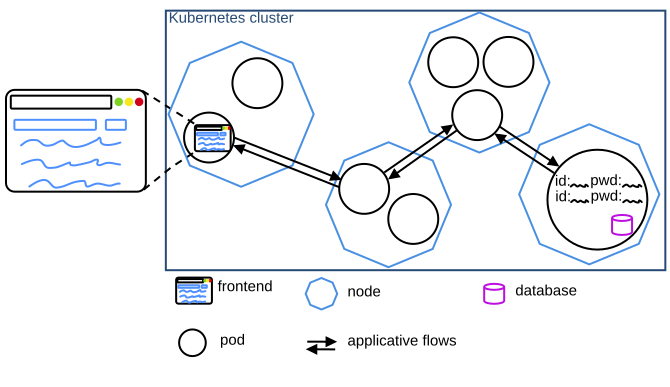
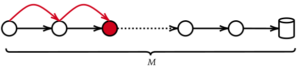

# Project Introduction

The goal of the project is to create a cloud environment, and to then attack it. To do so, we use [Vagrant](https://developer.hashicorp.com/vagrant/docs) to first deploy the Virtual Machines we need and to prepare the environment. Then, we create a [Kubernetes](https://kubernetes.io/docs/home/) cluster, using [Kubeadm](https://kubernetes.io/docs/setup/production-environment/tools/kubeadm/create-cluster-kubeadm/). Finally, we deploy some vulnerable services which are chained using network rules.

The attacker (i.e. the students) will use lateral movement to attack the cluster. The attacker will first take control of a frontend service, and use this foothold to take control of other services deeper in the cluster, until reaching an important service (such as a database).

## Pre-requisites

- Ubuntu 24.04
- Admin rights